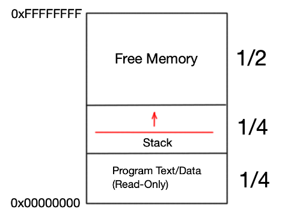

# CVM

__CVM__ is a simple virtual machine written in C.
<!-- 
## Primitive Data Types
* `char` : an unsigned byte.
* `int` : a signed 4 byte integer.
* `long` : a signed 8 byte integer.
* `float` : a 4 byte single-precision floating-point number.
* `double` : an 8 byte double-precision floating-point number.
* `address` : a unsigned 4 byte integer representing an address in memory. -->

## Memory
A process running on the __CVM__ can be allocated any number of bytes 
between $2^{24}$ and $2^{32}$ which is a power of 2. The default being $2^{28}$ bytes.

Below is the memory space of a process running on the __CVM__. 
This process has been allocated the maximum number of bytes ($2^{32}$ bytes or ~4 GB).



Regardless of the size of the memory space, the proportions of each section remain the same.
The Program Text and Data section occupies the bottom quarter of the space and is Read-Only.
The next quarter is occupied by the Stack. The remaining half of the memory is saved for dynamic usage. 

## Object Files

The __CVM__ runs object files with the extension *.cvmo*.
These are binary files with the following structure.

The first two bytes must have the hex value `C0DE`. 
This let's the __CVM__ know the given file is an executable object file.

The rest of the file contains a sequence of entries. 
Each entry can have one of the following three structures. 

__NOTE__, in the following code segments...
* `()` represent comments. 
* `__` represents a single byte.
* `__ ... __` represents a sequence of bytes.
* Uncommented letters and numbers are hexadecimal.

 
### 1. Internal Function
```
1F            (Internal Function identifier)
__ __ __ __   (Signed offset to file name entry)  
__            (Unsigned function name length l where l > 0) 
__ ... __     (l bytes, each representing an ascii character)
00            (Terminator for function name string)
__            (Unsigned size of parameter block p)
__            (Unsigned size of local variable array s where s >= p)
__ __         (Unsigned size of operand stack size o)
__ __         (Unsigned size of constant pool r)
__ ... __     (r bytes representing the constant pool)
__ __ __ __   (Unsigned size of code section c)
__ ... __     (c bytes representing the code section)
```
Internal Functions are the most important entries found in __CVM__ object files.
They represent executable segments of code. 
The structure of an Internal Function entry outlines to the __CVM__ 
how said function's stack frame should be created and organized.

### 2. External Function
```
EF            (External Function identifier)
__            (Unsigned function name length l where l > 0)
__ ... __     (l bytes, each representing an ascii character)
00            (Terminator for the function name string)
__ __ __ __   (Signed offset to resolving function)
```
External Function entries are explicitly used for linking together __CVM__ 
object files.


### 3. File Entry
```
FE            (File Entry identifier)
__            (Unsigned file name length l where l > 0)
__ ... __     (l bytes, each representing an ascii character)
00            (Terminator for the file name string)
```
File Entries store file names for debugging purposes. 
All Internal Functions should referene a File Entry.
This tells the __CVM__ from which file a given block of code originates from.

## Instruction Set

The __CVM__ reads 1 byte opcodes.

### Primitive Type Arithmetic Opcodes
* `char` Opcodes
  * `cadd` 
  * `csub`
  * `cmul`
  * `cdiv`
  * `cmod`
  * `cneg`
  * `ccmp`
  * `ctoi`
  * `ctol`
  * `ctof`
  * `ctod`
* `int` Opcodes
  * `iadd`
  * `isub`
  * `imul`
  * `idiv`
  * `imod`
  * `ineg`
  * `icmp`
  * `itoc`
  * `itol`
  * `itof`
  * `itod`
* `long` Opcodes
  * `ladd`
  * `lsub`
  * `lmul`
  * `ldiv`
  * `lmod`
  * `lneg`
  * `lcmp`
  * `ltoc`
  * `ltoi`
  * `ltof`
  * `ltod`
* `float` Opcodes
  * `fadd`
  * `fsub`
  * `fmul`
  * `fdiv`
  * `fneg`
  * `fcmp`
  * `ftoc`
  * `ftoi`
  * `ftol`
  * `ftod`
* `double` Opcodes
  * `dadd`
  * `dsub`
  * `dmul`
  * `ddiv`
  * `dneg`
  * `dcmp`
  * `dtoc`
  * `dtoi`
  * `dtol`
  * `dtof`
* `address` Opcodes
  * `aadd`
  * `asub`
  * `amul`
  * `adiv`
  * `amod`
  * `aneg`
  * `acmp`

### Bitwise Arithmetic Opcodes
* 1 Byte Arithmetic Opcodes
  * `ucpl`
  * `uand`
  * `uor`
  * `uxor`
  * `ulsh`
  * `ursh`
* 4 Byte Arithmetic Opcodes
  * `qcpl`
  * `qand`
  * `qor`
  * `qxor`
  * `qlsh`
  * `qrsh`
* 8 Byte Arithmetic Opcodes
  * `ocpl`
  * `oand`
  * `oor`
  * `oxor`
  * `olsh`
  * `orsh`

### Program Control Opcodes
* Static Control Opcodes
  * `ifeq <address>`
  * `ifne <address>`
  * `ifgt <address>`
  * `ifge <address>`
  * `iflt <address>`
  * `ifle <address>`
  * `goto <address>`
  * `call <address>`
* Dynamic Control Opcodes
  * `*ifeq`
  * `*ifne`
  * `*ifgt`
  * `*ifge`
  * `*iflt`
  * `*ifle`
  * `*goto`
  * `*call`


